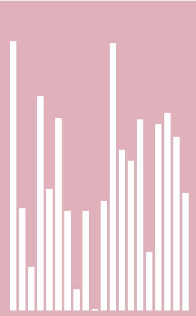
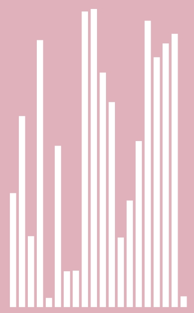

# sound-chart
sound chart (類似音頻的條狀圖，改自Android群英傳例題)

※這裡只有做呈現的部分，並沒有真的去抓取真實的聲音去做顯示。
條狀圖會跳動只是單純取隨機數讓他動態的改變長短。

  
↓ 音頻圖1 

 
↓ 音頻圖2 

 
↓ 音頻圖3 

App download ↓ 
https://drive.google.com/open?id=0B0csiWXavBDHcnZMeUNiNDBtZHc
